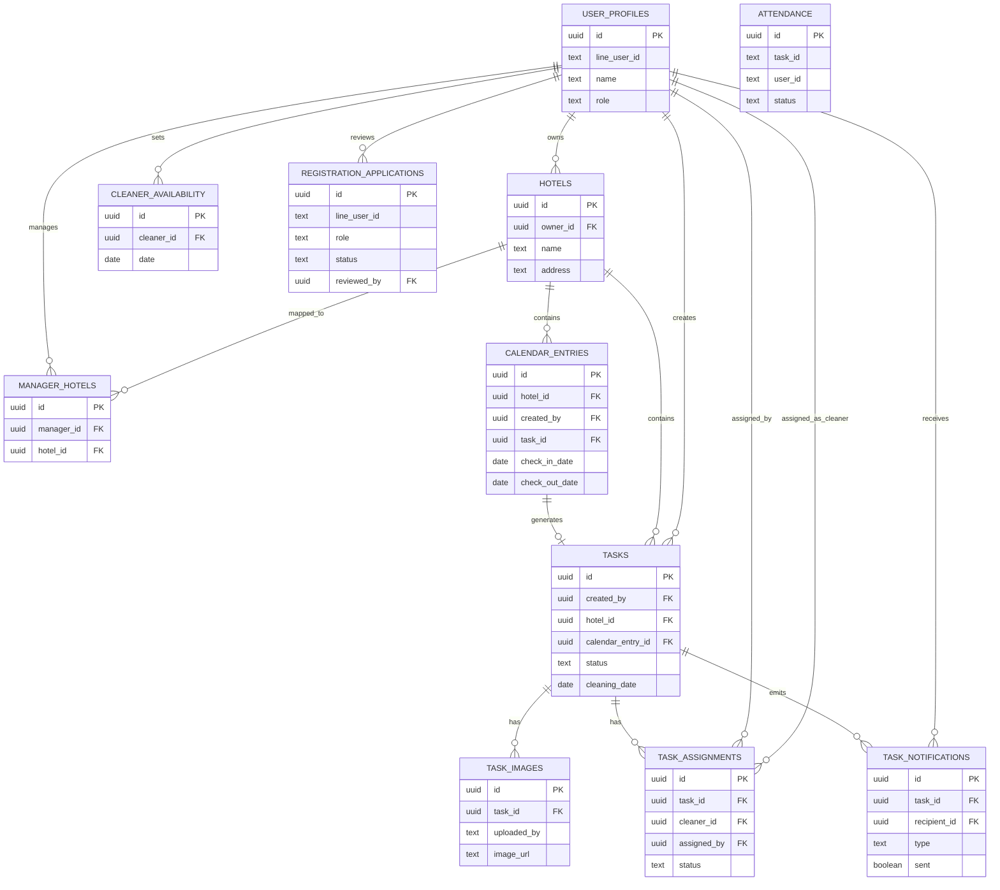

# SOJIO

SOJIO is a hotel operations platform focused on cleaning workflow execution.  
It provides role-based dashboards, task scheduling, assignment tracking, and LINE-integrated notifications for owner, manager, and cleaner teams.

## Why This Project

Hotel cleaning operations are often coordinated through chat tools and spreadsheets, which leads to:
- fragmented task visibility,
- delayed status updates,
- unclear assignment ownership, and
- inconsistent execution records.

SOJIO addresses this with a single workflow system backed by a structured data model and role-aware access control.

## Core Capabilities

- Role-based access for `owner`, `manager`, and `cleaner`
- LINE-based identity and login flow
- Calendar-driven cleaning planning
- Task assignment, acceptance, and completion lifecycle
- Availability management for cleaners
- Notification delivery and delivery status tracking
- Registration application review flow for onboarding

## Technology Stack

- Frontend: `Next.js 15` (App Router), `React 19`, `Tailwind CSS`
- Backend/API: `Next.js Route Handlers`
- Database: `Supabase Postgres`
- Data Security: Postgres RLS + policy-based access control
- State Management: `Zustand`
- Deployment: `Vercel`

## Project Structure

```text
sojio_app/
├── app/                 # Next.js app routes and API handlers
├── components/          # Reusable UI components
├── hooks/               # React hooks
├── lib/                 # Services and domain helpers
├── store/               # Zustand stores
├── types/               # TypeScript domain types
├── locales/             # i18n resources
├── supabase/            # Schema, migrations, and database docs
└── README.md
```

## Data Model (ER Diagram)

The following ER diagram summarizes the core relational model currently used in Supabase.



## Security Notes

- Row-Level Security policies are actively managed in migrations.
- The migration `011_harden_anon_with_guest_sandbox.sql` narrows anonymous access to demo/sandbox records.
- Production-grade access should rely on authenticated identity and least-privilege policies.

## Local Development

### Prerequisites

- Node.js `20+`
- npm
- Supabase project (or local Supabase setup)
- LINE developer credentials

### Setup

```bash
npm install
npm run dev
```

Create `.env.local` manually before running the app, and define required Supabase and LINE environment variables.

Open `http://localhost:3000`.

## Architecture Documentation

Detailed architecture and operational design are documented in `architecture.md`.

## Roadmap (Engineering-Focused)

- Refine domain boundaries between API routes and service layer
- Introduce test coverage for critical assignment/notification flows
- Complete migration from mixed `text/uuid` IDs to consistent typed keys
- Strengthen observability for background notification jobs
